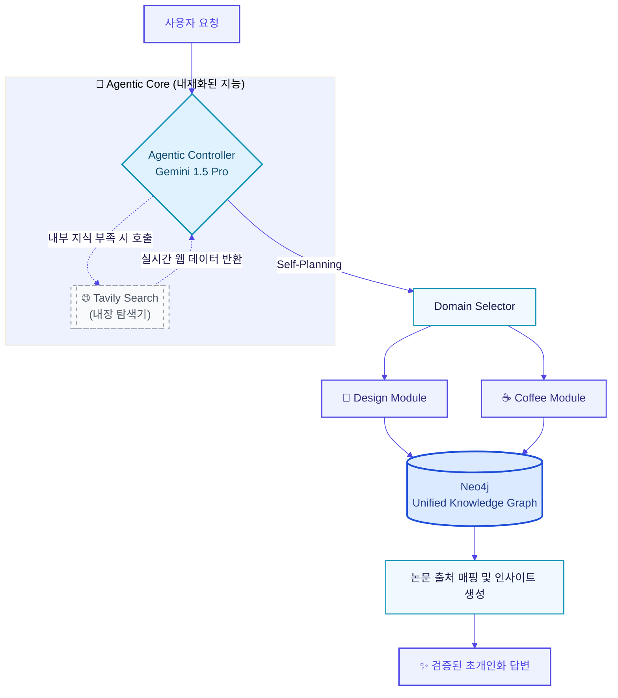

# 🧠 Y-Insight Engine (YIE)

> **The Unified Intelligence Engine for Cross-Domain Insights**

---

<p align="left">
  
  
</p>

<br>

🖋️ **Introduction**  
**Y-Insight Engine (YIE)**는 여러 독립적인 서비스(Mood-DNA, Cof/fee, Packy)의 지능을 하나로 통합하여 관리하는 **에이전틱 백엔드 엔진**입니다. 단순히 데이터를 처리하는 서버를 넘어, 사용자의 라이프스타일과 디자인 감각을 연결하는 **'공통의 뇌'** 역할을 수행합니다.

이 엔진은 **Hybrid GraphRAG**와 **Agentic Search**를 통해 도메인 간의 지식을 융합하고, 시간이 흐를수록 사용자를 더 잘 이해하는 초개인화된 인사이트를 도출합니다.

<br>

<p align="left">
  
  
  
  
  
  
</p>

---

## 🚀 Core Strategy

### 🕸️ 1. Unified Knowledge Graph (Shared Memory)
모든 앱의 데이터는 **Neo4j 기반의 단일 지식 그래프**에 저장됩니다.
*   **Design Domain:** 시각적 지표와 디자인 이론의 관계.
*   **Health Domain:** 카페인 섭취와 신체 반응(통증, 컨디션)의 인과관계.
*   **Synergy:** "피로도가 높은 날(Health) 작업한 디자인의 특징(Design)"을 분석하는 등 도메인 간 교차 추론 수행.

### 🤖 2. Agentic Reasoning Pipeline
AI 에이전트가 사용자 요청의 의도를 파악하고 스스로 행동을 계획(Self-Planning)합니다.
*   **Self-Planning:** 요청에 따라 어떤 도메인 지식을 꺼내올지 스스로 결정.
*   **Tavily Search Agent:** 내부 지식이 부족할 경우, 실시간 외부 웹 데이터를 검색하여 근거 보강.
*   **LLM Relay:** Gemini 1.5 Pro를 컨트롤러로 하여 상황에 최적인 모델(Groq, Ollama)을 배분.

### 🔌 3. Plug-and-Play Domain Services
새로운 서비스가 추가되어도 엔진의 구조를 변경할 필요가 없습니다.
*   `services/design`: 디자인 분석 특화 모듈
*   `services/coffee`: 신체 반응 추론 특화 모듈
*   `services/travel`: (Coming Soon) 여행 경험 최적화 모듈

### 📚 4. Academic Grounding (학술적 근거 기반 추론)
단순한 생성형 AI의 한계를 넘어, **전문 학술 데이터**를 바탕으로 근거 있는 답변을 제공합니다.
- **`design_wisdom/`**: 디자인 심리학, 색채학, 타이포그래피 논문 데이터를 기반으로 한 객관적 디자인 비평.
- **`health_wisdom/`**: 생리학, 식품영양학 논문을 참조하여 카페인 대사 및 신체 영향을 과학적으로 분석.

---



---

## 🛠️ Tech Stack

*   **Framework:** FastAPI (Python 3.10+)
*   **Orchestration:** LlamaIndex (Agentic Workflow)
*   **Graph Database:** Neo4j (GraphRAG)
*   **Search Engine:** Tavily API, SerpApi
*   **AI Models:** Google Gemini 1.5 Pro, Llama 3.3, Moondream2

---

## 📱 Domain Services

### 🌙 Mood-DNA
디자인 이미지를 분석하여 색채, 타이포그래피, 레이아웃을 학술 데이터 기반으로 비평합니다. 단순한 "예쁘다/안예쁘다"를 넘어 디자인 심리학적 근거를 제시합니다.

### ☕ Cof/fee
카페인 섭취 패턴과 신체 반응(두통, 집중도, 수면 질 등)의 인과관계를 추적합니다. 생리학 논문을 참조하여 개인화된 카페인 섭취 가이드를 제공합니다.

### 🧳 Packy *(Coming Soon — 5월 확장 예정)*
여행 짐 목록과 여행 경험 데이터를 기반으로 목적지별 최적 준비 가이드를 제안합니다. 기후, 활동 유형, 개인 선호도를 교차 분석하여 초개인화된 패킹 리스트를 생성합니다.

---

## ⚡ Getting Started

### 1. 저장소 클론
```bash
git clone https://github.com/your-username/Universal-Insight-Engine.git
cd Universal-Insight-Engine/Yongyong-Agentic-Core
```

### 2. 패키지 설치
```bash
pip install -r requirements.txt
```

### 3. 환경변수 설정
```bash
cp .env.example .env
# .env 파일을 열어 API 키를 입력하세요
```

### 4. Neo4j 실행
```bash
# Docker를 사용하는 경우
docker run \
  --name neo4j-yie \
  -p 7474:7474 -p 7687:7687 \
  -e NEO4J_AUTH=neo4j/your_password \
  neo4j:latest
```

### 5. 서버 실행
```bash
uvicorn app.main:app --reload
```

서버가 실행되면 `http://localhost:8000/docs`에서 API 문서를 확인할 수 있습니다.

---

## 🔑 Environment Variables

`.env` 파일에 아래 키들을 설정해야 합니다.

```env
# AI Models
GOOGLE_API_KEY=your_gemini_api_key
GROQ_API_KEY=your_groq_api_key

# Search
TAVILY_API_KEY=your_tavily_api_key
SERPAPI_KEY=your_serpapi_key

# Database
NEO4J_URI=bolt://localhost:7687
NEO4J_USERNAME=neo4j
NEO4J_PASSWORD=your_password
```

> 각 API 키 발급 방법: [Google AI Studio](https://aistudio.google.com) · [Groq Console](https://console.groq.com) · [Tavily](https://tavily.com)

---

## 📁 Project Structure

```bash
Universal-Insight-Engine/
└── Yongyong-Agentic-Core/
    ├── app/
    │   ├── core/                  # 🧠 공통 지능 엔진 (Agentic Core)
    │   │   ├── __init__.py
    │   │   ├── graph.py           # 통합 지식 그래프 (Neo4j)
    │   │   ├── provider.py        # LLM 모델 연결 (Gemini, Groq 등)
    │   │   └── search.py          # Tavily 외부 지식 탐색 에이전트
    │   │
    │   ├── services/              # 🔌 도메인별 특화 서비스
    │   │   ├── coffee/            # ☕ [Cof/fee] 
    │   │   │   ├── __init__.py
    │   │   │   ├── advisor.py     # 카페인 기반 컨디션 조언 로직
    │   │   │   └── tracker.py     # 신체 반응 추적 및 분석
    │   │   │
    │   │   ├── design/            # 🌙 [Mood-DNA] 학술 기반 디자인 비평 엔진
    │   │   │   ├── __init__.py
    │   │   │   ├── design_analyzer.py   # 시각적 지표(OpenCV/OCR) 분석
    │   │   │   └── design_consultant.py # 하이브리드 RAG 디자인 비평
    │   │   │
    │   │   └── travel/            # 🧳 [Packy] (5월 확장 예정)
    │   │
    │   ├── database.py            # ⚙️ 공통 DB 모델
    │   └── main.py                # 🚦 통합 API 게이트웨이 (FastAPI)
    │
    ├── design_wisdom/             # 📚 디자인 지식 텍스트 저장소
    ├── health_wisdom/             # 🍎 건강/카페인 지식 텍스트 저장소
    ├── .env.example               # 🔑 환경변수 템플릿
    ├── .env                       # 🔑 API Key 모음 (git 제외)
    ├── .gitignore                 
    ├── README.md                  # 📄 통합 프로젝트 설명서
    └── requirements.txt           # 📦 파이썬 패키지 의존성 목록
```

---

## ✨ Vision
"분절된 앱의 기능을 넘어, 통합된 지능의 경험으로."
